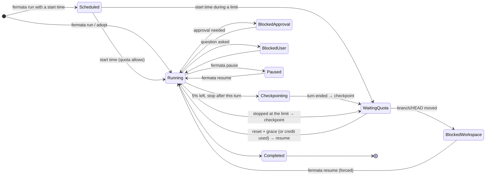
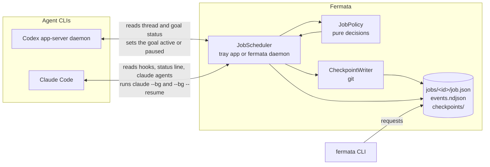

<p align="center"></p>

<p align="center">
  <a href="https://github.com/fatih-developer/fermata/actions/workflows/ci.yml"></a>
  <a href="https://github.com/fatih-developer/fermata/releases/latest"></a>
  
  
</p>

<p align="center"><b>English</b> · <a href="docs/README.tr.md">Türkçe</a></p>

# Fermata

In music, a *fermata* tells the player to hold, then go on. **Fermata does that for long AI coding jobs.**

Long Codex and Claude Code runs die on usage limits: the 5-hour window fills up at 2 a.m., the agent stops mid-task, and in the morning you have to work out where it was. Fermata is a small local supervisor that sits next to the agent CLIs you already use:

- **before the limit** it asks the agent for a handoff note and records a git checkpoint,
- **at the limit** it waits for the reset, without racing the agent's own recovery,
- **after the reset** it resumes the same session where it stopped. It also checks that the repository has not moved on in the meantime.

It also starts jobs later (`--at 07:30`, `--in 2h`), picks up jobs after a reboot, and, for Codex, can redeem a **reset credit with your consent**.

<p align="center">
  
  &nbsp;
  
</p>

## Contents

- [Features](#features)
- [How it works](#how-it-works)
- [Quick start](#quick-start)
- [Commands](#commands)
- [Codex](#codex)
- [Claude Code](#claude-code)
- [Desktop app](#desktop-app)
- [Configuration](#configuration)
- [Safety and privacy](#safety-and-privacy)
- [Architecture](#architecture)
- [Building and testing](#building-and-testing)
- [Status](#status)

## Features

| | |
|---|---|
| **Quota-aware jobs** | `fermata run --provider codex\|claude --objective "…"` starts a supervised job. Fermata watches the 5-hour and weekly windows of that provider. |
| **Checkpoint before the limit** | At 10 % left it asks the agent for `.fermata/handoff.md`. At 5 % left it stops after the current turn and records branch, HEAD, `git status` and `git diff --stat`. No LLM is involved in the checkpoint itself. |
| **Resume after the reset** | It resumes when the provider allows work again: at the latest reset time plus a grace period, or right away when Codex confirms usage is allowed (for example after you used a credit). |
| **Never races native recovery** | While a Codex goal keeps going or Claude Code's own auto-resume is armed, Fermata waits. It only steps in when nothing else will continue the work. |
| **Approvals stay yours** | Fermata never sends turns itself. Jobs that wait for an approval or an answer are flagged, and the notification tells you how to attach (`codex resume <id>`, `claude attach <id>`). |
| **Workspace guard** | If the branch or HEAD changed since the checkpoint, the job is held as `workspace-changed` until you run `fermata resume <id> --force`. |
| **Scheduling and recovery** | `--at` and `--in` schedule a start. The scheduler checks the wall clock, so wake-up from sleep is caught at once, and open jobs are reloaded after a reboot. |
| **Codex reset credits** | Detects a Codex limit and redeems a reset credit in *manual*, *confirm* or *automatic* mode. A credit is never used twice for one limit, and daily and weekly caps apply. |
| **Inside the agents** | Codex hooks and a skill, a Claude Code status line wrapper, hooks and a skill, and an MCP server with read-only `codex_usage` and `fermata_jobs` tools. |
| **Local-first** | Plain files under your user profile. No account, no telemetry, no API keys. |

## How it works



All of these decisions come from one pure function, `JobPolicy.Decide(job, context)`, which is covered by unit tests state by state. Around it:



**Quota levels.** Fermata looks at the fullest window:

| Level | Condition | Action |
|---|---|---|
| Prepare | ≤ `prepare_remaining` (10 %) left | ask for the handoff note (Claude) or record a checkpoint (Codex) |
| Stop new work | ≤ `stop_remaining` (5 %) left | let the current turn finish, then checkpoint |
| Blocked | the provider refuses work | wait until `max(resets_at) + grace_seconds` (90 s) |

## Quick start

1. Download the package for your platform from [Releases](https://github.com/fatih-developer/fermata/releases/latest) and unpack it. Windows: `fermata-win-x64.zip`. macOS: `Fermata.app` in `fermata-macos-*.tar.gz`. Linux: `fermata-linux-*.tar.gz`.
2. Start the tray app (`FermataApp`), or run `fermata daemon` on a headless machine. The scheduler and the Codex monitor live there.
3. Connect the agents you use:

   ```bash
   fermata codex install    # Codex: hooks, skill, MCP server
   fermata claude install   # Claude Code: status line wrapper, hooks, skill, MCP server
   fermata doctor           # checks Codex, Claude Code, git, jobs and notifications
   ```

4. Start a job:

   ```bash
   fermata run --provider claude --objective "Port the parser to the new AST API and keep the tests green"
   fermata run --provider codex --goal TASK.md --name payments --at 07:30
   fermata jobs
   ```

   ```text
   ID                           PROVIDER STATUS           NEXT               OBJECTIVE
   payments                     codex    scheduled        starts in 6h 12m   Migrate the payment module to the new API…
   parser-port                  claude   waiting-quota    resumes in 2h 10m  Port the parser to the new AST API and k…
   ```

Requirements: a logged-in Codex CLI (`codex login`) for Codex jobs and credits; Claude Code (verified with 2.1.289) for Claude jobs; `git` for checkpoints and the workspace guard.

## Commands

```bash
fermata run --provider codex|claude (--objective "…" | --goal FILE) [--cwd DIR] [--name NAME] [--at T | --in D] [--approvals …]
fermata adopt --provider codex|claude (<session-id> | --latest) [--objective "…"]
fermata jobs [--json] [--all]
fermata job <id> [--json]
fermata pause <id> [--resume-at T | --resume-in D]
fermata resume <id> [--at T | --in D | --when-quota-available | --now] [--force]
fermata checkpoint <id>
fermata cancel <id>                      # stops supervising; the session itself is kept

fermata status | watch | reset | daemon  # Codex usage monitor and reset credits
fermata codex  status|install|uninstall|continue
fermata claude status|install|uninstall
fermata doctor | config | logs | diagnostics | update | autostart
```

Times are local: `--at 07:30` (the next 07:30), `--at "2026-10-06 22:00"`, `--in 45m`, `--in 1h30m`, `--in 1d`.

When neither the tray app nor `fermata daemon` runs, CLI commands do the work themselves. Otherwise they hand it to the running scheduler through the job folder.

## Codex

- Jobs run as **threads with a goal** in Codex's shared app-server daemon (`codex app-server daemon`, started on demand). Fermata starts the thread, unsubscribes from it and sets the goal; Codex runs the turns, so approval prompts reach *your* Codex client. Attach with `codex resume <thread-id>`.
- When a limit stops the goal (`usageLimited`), the job waits. It resumes the goal when the monitor reports that usage is allowed again, which happens at the reset or right after a reset credit.
- `fermata adopt --provider codex <thread> --objective "…"` takes over a live thread. A thread without a goal needs `--objective`, because Fermata continues Codex work only through goals.
- **Reset credits:** `fermata reset`, "Reset now…" in the tray, or Auto-reset (automatic mode with daily and weekly caps, a cooldown and an explicit opt-in). Credits are only used when Codex itself reports the block, never twice for the same limit, and never for workspace limits.
- **Inside Codex:** hooks show remaining time and credits at session start and near the limit; the skill and the MCP tools let the model read usage and jobs. None of them can redeem a credit.

## Claude Code

- Claude Code exposes its quota only to the **status line** of a running session. `fermata claude statusline` records `rate_limits` and then runs *your previous status line* with the same input, so your status line looks the same as before.
- **Hooks** record session start and end, limit failures (`StopFailure: rate_limit`), auto-resume fired/stale/disabled, permission and input prompts, and completion. The **Stop** hook asks for `.fermata/handoff.md` once per limit episode and is loop-safe through `stop_hook_active`.
- Jobs start with `claude --bg` and resume with `claude --bg --resume <session> "<prompt>"`. While Claude's own auto-resume can still fire, Fermata waits.
- **Reset credits:** Claude credits can only be redeemed on claude.ai ("Limit resets"). There is no CLI or API for them, so Fermata does not try. For long waits it notifies you and shows **Open Claude limit resets…** in the tray; after you redeem one, `fermata resume <id> --now` continues the job.
- Claude Code asks you to trust a folder once before `--bg` can run in it: open `claude` there once.

## Desktop app

<p align="center">
  
  &nbsp;
  
</p>

`FermataApp` lives in the Windows tray, the macOS menu bar or a Linux StatusNotifierItem host:

- **Tray panel:** 5-hour and weekly usage, supervised jobs with their next step and Pause/Resume, reset credits, the Auto-reset switch and "Reset now…".
- **Details:** each job's reason, objective, attach command and recent events; settings; and the event log.
- **Notifications** for job starts, waits, resumes, approvals, questions, workspace changes and credit suggestions.
- **Settings:** reset mode, check interval, notifications, start at login, "Add to Codex" and "Add to Claude Code".

The tray icon shows the fuller window at a glance:

<p>
  
  
  
  
</p>

## Configuration

`config.toml` lives in the data directory: `%APPDATA%\Fermata` on Windows, `~/Library/Application Support/Fermata` on macOS and `~/.config/fermata` on Linux. `FERMATA_HOME` overrides the location. `fermata config --init` writes a commented default file.

```toml
mode = "confirm"                  # Codex credits: manual | confirm | automatic

[jobs]
prepare_remaining = 10            # % left: ask for the handoff note
stop_remaining = 5                # % left: stop after this turn (0 = only at the limit)
grace_seconds = 90                # wait after the reset time
save_patch = false                # also store `git diff` in checkpoints

[jobs.codex]
approvals = "user"                # who answers approvals: "user" | "auto_review"
model = ""                        # empty = your Codex default

[jobs.claude]
executable = ""                   # empty = PATH, then ~/.local/bin
permission_mode = "default"       # never bypassPermissions by default
suggest_reset_after_minutes = 120
limit_resets_url = "https://claude.ai/settings/usage"
```

Job data lives in `jobs/<id>/`: `job.json` (written atomically), `events.ndjson` and `checkpoints/*.json`.

## Safety and privacy

- **No secrets, no telemetry.** Fermata uses the Codex and Claude Code sessions you are already logged into. The only other network request is a daily read of the public GitHub release feed, which you can switch off.
- **Credits are your decision.** Codex credits are redeemed only in a mode you chose, with idempotency keys, a cross-process lock, a cooldown and caps. Claude credits are never redeemed by Fermata.
- **Your settings are preserved.** The installers keep everything else in `hooks.json` and `settings.json`, write a `.fermata.bak` backup, refuse to touch files they cannot parse, and restore your status line on uninstall.
- **Hooks never get in the way.** Every hook and the status line wrapper exit successfully in all cases.
- **Updates are verified** against `SHA256SUMS.txt` before installing.

## Architecture

| Project | Responsibility |
|---|---|
| `Fermata.Core` | Domain model and limit rules, `ResetManager`; the job core: `Job`, `QuotaSnapshot`, `QuotaPolicy`, `JobPolicy` (pure) and `IJobProvider` |
| `Fermata.Codex` | `codex app-server` client, `CodexDaemonClient` for the shared daemon, `CodexJobProvider` |
| `Fermata.Claude` | `ClaudeCli`, `ClaudeJobProvider`, the `settings.json` installer, status line and hook handlers |
| `Fermata.Platform` | Paths, TOML config, atomic files, locks, notifications, autostart and updates; the job store, `CheckpointWriter` and `JobScheduler` |
| `Fermata.Cli` | The `fermata` command line |
| `Fermata.Desktop` | `FermataApp`, the Avalonia tray and menu bar app |

Design notes and the verified protocol facts behind them: [`docs/Fermata-Design.md`](docs/Fermata-Design.md). Product requirements for the Codex credit part: [`docs/Fermata-PRD.md`](docs/Fermata-PRD.md). Codex App Server protocol: [`docs/CODEX_INTEGRATION.md`](docs/CODEX_INTEGRATION.md).

## Building and testing

```bash
dotnet test                                   # core, Codex and platform tests
scripts/test-in-docker.sh Fermata.slnx        # the whole solution, including the desktop app, in a Linux container
scripts/package.sh win-x64                    # artifacts/package/fermata-win-x64.zip (also linux-*, osx-*)
```

End-to-end runs without spending credits or tokens:

- `scripts/fake-codex/` is a fake `codex app-server` with an account at its limit, for the monitor and the reset flow.
- Codex jobs: set `[jobs.codex] model = "some-invalid-model"`. `fermata run --provider codex …` then creates the real thread and goal, and the turn fails immediately.
- `scripts/fake-claude/` is a fake `claude` (`--bg`, `--bg --resume`, `agents --json`, `stop`) for Claude jobs. Pipe JSON into `fermata claude hook <event>` and `fermata claude statusline` to drive hooks, and point `CLAUDE_CONFIG_DIR` at a scratch folder.

On Windows with Smart App Control, unsigned development builds of the desktop app may be blocked. In that case build it with `scripts/dotnet-in-docker.sh`.

## Status

**0.5.0.** Supervised jobs for Codex and Claude Code, together with the Codex usage monitor and reset credits, CLI, tray and menu bar app, notifications, start at login, near-limit warnings, self-update and diagnostics.

Still open: signed (Authenticode / notarized) releases. A few Claude Code behaviours need a real session to confirm, such as Stop-hook blocking in background sessions and the exact `rate_limits` payload; see the design notes.
