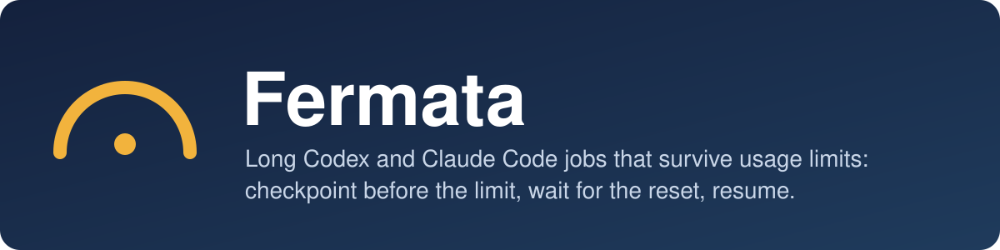
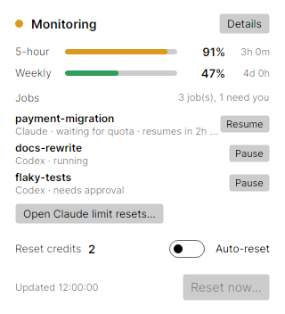
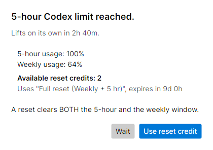
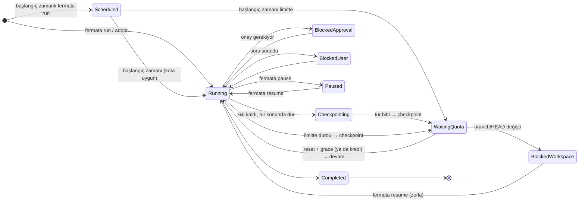
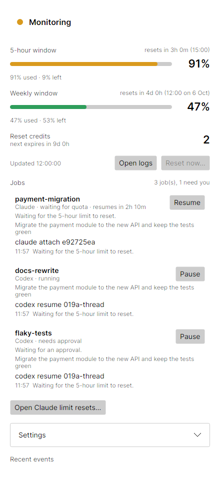
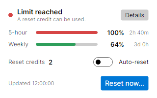

<p align="center"></p>

# Fermata

> English: [README.md](../README.md)

<p align="center">
  
  
</p>

Uzun Codex ve Claude Code işlerini kullanım limitleri boyunca yöneten, yerel çalışan bir job supervisor. Fermata bir işi limit dolmadan durdurur (handoff notu + git checkpoint), reset zamanını bekler ve aynı oturumu kaldığı yerden sürdürür. İleri tarihli başlatma (`--at`, `--in`) ve bilgisayar yeniden başladıktan sonra kurtarma da yapar. Codex için ayrıca limit dolunca **sizin onayınızla** reset kredisi kullanır.

- Tasarım (job katmanı, Codex ve Claude sağlayıcıları): [`docs/Fermata-Design.md`](Fermata-Design.md)
- Ürün tanımı (Codex limit/reset kısmı): [`docs/Fermata-PRD.md`](Fermata-PRD.md)
- Codex App Server protokolü: [`docs/CODEX_INTEGRATION.md`](CODEX_INTEGRATION.md)

## Durum

0.5.0: Codex kullanım monitörü ve reset kredileri (CLI, tray / menu bar uygulaması, bildirimler, açılışta başlatma, limite yaklaşma uyarıları, otomatik güncelleme, tanılama) ve job katmanı: `run`, `adopt`, `jobs`, `job`, `pause`, `resume`, `cancel`, `checkpoint`; Codex ve Claude Code sağlayıcıları; `fermata claude install`; MCP'de `fermata_jobs`; tray'de job satırları. Açık iş: imzalı (Authenticode / notarized) release'ler.

## Gereksinimler

- .NET 10 SDK
- Codex işleri ve reset kredileri için giriş yapılmış bir Codex CLI (`codex login`). Fermata API key istemez.
- Claude işleri için Claude Code (2.1.289 ile doğrulandı) ve `fermata claude install`.
- Checkpoint ve workspace kontrolü için `git` (yoksa bu adımlar atlanır).

## Job'lar

```bash
fermata run --provider codex  --objective "Ödeme modülünü yeni API'ye taşı, testler yeşil kalsın"
fermata run --provider claude --goal TASK.md --name parser-port --at 07:30   # ya da --in 2h
fermata adopt --provider claude --latest              # açık bir Claude oturumunu sahiplen
fermata adopt --provider codex 019a… --objective "…"  # goal'ü olmayan Codex thread'i için --objective gerekir
fermata jobs                                          # liste (--json, --all)
fermata job parser-port                               # ayrıntı + son olaylar
fermata pause parser-port [--resume-at 22:00 | --resume-in 3h]
fermata resume parser-port [--at T | --in D | --when-quota-available | --now] [--force]
fermata checkpoint parser-port
fermata cancel parser-port                            # denetimi bırakır, oturum kalır
```

Nasıl çalışır:

- **Kota seviyeleri** (en dolu pencerenin kalan yüzdesi): `prepare_remaining` (varsayılan %10) altında ajandan `.fermata/handoff.md` istenir; `stop_remaining` (%5) altında iş tur sonunda durdurulur ve checkpoint yazılır; limit dolunca reset beklenir. Devam zamanı, bloklayan pencerelerin en geç `resets_at`'i + `grace_seconds` (90) olur.
- **Checkpoint** LLM kullanmaz: branch, HEAD, `git status --porcelain`, `git diff --stat` (istenirse patch), oturum ve kota `jobs/<id>/checkpoints/` altına yazılır. `.fermata/` satırı `.git/info/exclude`'a eklenir; commit'leri kirletmez.
- **Workspace kontrolü:** Devam etmeden önce branch/HEAD checkpoint'le karşılaştırılır. Değişmişse job `workspace-changed` olur ve bildirim gelir; `fermata resume <id> --force` ile geçilir.
- **Native mekanizmalarla yarışmaz:** Codex goal'ü sürüyorsa ya da Claude'un kendi auto-resume'u kuruluysa Fermata bekler; yalnızca onlar devam etmeyecekse devreye girer.
- **Onaylar kullanıcıya gider:** Fermata tur başlatmaz. Onay ya da soru bekleyen job `needs-approval` / `needs-input` olur; bildirim nasıl bağlanacağınızı söyler (`codex resume <id>`, `claude attach <id>`).
- **Zamanlayıcı** masaüstü uygulamasında ya da `fermata daemon`'da çalışır (tek süreç, `jobs.lock`). Uykudan uyanınca kaçırılan zamanları hemen yakalar, açılışta açık job'ları yükler. İkisi de çalışmıyorsa CLI komutları işi kendisi yapar.



### Claude Code içinde

```bash
fermata claude install    # status line sarmalayıcı + hook'lar + skill + MCP (masaüstünde: Settings → Add to Claude Code)
fermata claude status
fermata claude uninstall  # önceki status line geri gelir
```

- **Status line sarmalayıcı:** Claude Code kotayı yalnızca çalışan oturumun status line girdisinde (`rate_limits`) verir. `fermata claude statusline` bunu `claude-quota.json`'a yazar, sonra önceki status line komutunuzu aynı girdiyle çalıştırıp çıktısını aynen basar. Arka plan (`--bg`) oturumları da status line çalıştırır.
- **Hook'lar:** `SessionStart`, `SessionEnd`, `Notification` (auto-resume fired/stale/disabled, izin ve girdi istekleri, `agent_completed`), `Stop` (handoff isteği; `stop_hook_active` ile döngü korumalı) ve `StopFailure` (`rate_limit`). Hook'lar hiçbir zaman hata vermez.
- **Job'lar** `claude --bg` ile başlar; devam `claude --bg --resume <session> "<prompt>"` ile yapılır. Ek bayrak verilmez, çünkü Claude bayrakla çağrılınca kopya oturum açar. Claude Code `--bg` için klasörün bir kez güvenilir olarak onaylanmasını ister (`claude`'u o klasörde bir kez açın).
- **Reset kredileri:** Claude kredileri yalnızca claude.ai'deki "Limit resets" sayfasından kullanılabilir; CLI ya da API yoktur. Bekleme `suggest_reset_after_minutes`'tan (120) uzunsa Fermata bildirim gönderir ve tray'de "Open Claude limit resets…" düğmesi çıkar. Kredi kullandıktan sonra `fermata resume <id> --now` (ya da tray'de Resume).

## Masaüstü uygulaması

<p align="center">
  
  
</p>

`FermataApp` tray'de (Windows), menü çubuğunda (macOS) veya StatusNotifierItem olarak (Linux) yaşar:

- Tray ikonuna tıklamak küçük bir panel açar: 5 saatlik/haftalık kullanım, açık job'lar (durum, bir sonraki adım, Pause/Resume), krediler, **Auto-reset** anahtarı ve "Reset now…". Panel odak kaybedince kapanır. "Details" job ayrıntılarını, ayarları ve olay geçmişini içeren pencereyi açar.
- Confirm modunda Codex limiti dolunca bir onay penceresi açar. "Wait" varsayılandır; kredi yalnızca "Use reset credit" ile kullanılır.
- Auto-reset (automatic mod) açıkça onaylanarak açılır; günlük/haftalık sınır ve cooldown geçerlidir.
- Ayarlar: mod, kontrol aralığı, doğal açılma eşiği, bildirimler, açılışta başlatma, reset sonrası Codex goal'lerini sürdürme, Codex ve Claude Code entegrasyonları ("Add to Codex", "Add to Claude Code").
- Tray olmayan masaüstlerinde uygulamayı tekrar başlatmak penceresini öne getirir.

```bash
dotnet run --project src/Fermata.Desktop
```

### Codex içinde

```bash
fermata codex install     # hook'lar + skill + MCP sunucusu (masaüstünde: Settings → Add to Codex)
fermata codex status      # kurulum, monitor, Codex daemon ve canlı oturumlar
fermata codex continue    # limitte duran goal'leri şimdi sürdür (job'lara ait olanlar hariç)
fermata codex uninstall
```

- **Hook'lar** (`~/.codex/hooks.json`, `SessionStart` ve `UserPromptSubmit`): Codex oturum açılışında ve kullanım %95'i geçince ya da limit dolunca kalan süreyi, kredileri ve bir sonraki adımı gösterir. Yalnızca `status.json` okunur; hook Codex'e bağlanmaz, prompt'u asla engellemez. Codex yeni hook'ları ilk açılışta onay için listeler ("Trust all and continue" ya da `/hooks`).
- **MCP sunucusu** (`fermata mcp`, salt okunur `codex_usage` ve `fermata_jobs` araçları) ve **skill**: Codex içindeki model limitleri ve job'ları okuyabilir. Kredi kullanmaz; reset kararı her zaman kullanıcıdadır.
- **Status line:** Codex TUI'de `/statusline` ile `five-hour-limit` ve `weekly-limit` eklenir.
- **Job'lar:** Fermata paylaşılan Codex daemon'unda (`codex app-server daemon`) bir thread açar, goal kurar ve thread'den aboneliğini kaldırır; turları Codex yürütür, onaylar sizin istemcinize gider. Limit dolunca goal `usageLimited` olur; Fermata monitörü kullanıma izin verildiğini gördüğünde goal'ü tekrar `active` yapar.
- **Job olmayan goal'ler:** Reset başarılı olunca (Auto-reset ya da onaylı reset) Fermata daemon'daki `usageLimited` goal'leri tekrar `active` yapar. Goal olmadan limitte duran oturumlar için bildirim gelir; o oturumda "continue" yazmak yeterli. `[codex] continue_after_reset = false` ile kapatılır.

## Kullanım

```bash
dotnet run --project src/Fermata.Cli -- status
dotnet run --project src/Fermata.Cli -- watch          # izler, limit dolunca [y/N] sorar
dotnet run --project src/Fermata.Cli -- status --json
dotnet run --project src/Fermata.Cli -- doctor         # Codex, Claude, git ve job kontrolleri
dotnet run --project src/Fermata.Cli -- config --init
dotnet run --project src/Fermata.Cli -- reset          # onay ister
dotnet run --project src/Fermata.Cli -- logs -n 100    # son log kayıtları (--json, --path)
dotnet run --project src/Fermata.Cli -- daemon         # başsız izleme + job zamanlayıcı (SSH, sunucu, systemd/launchd)
dotnet run --project src/Fermata.Cli -- autostart enable --target desktop
dotnet run --project src/Fermata.Cli -- doctor --notify # test bildirimi de gönderir
dotnet run --project src/Fermata.Cli -- update --check  # yeni sürüm var mı?
dotnet run --project src/Fermata.Cli -- diagnostics     # temizlenmiş tanılama zip'i
```

### Güncellemeler ve gizlilik

Fermata, Codex ve Claude Code dışında yalnızca bir ağ isteği yapar: masaüstü uygulaması günde bir kez herkese açık GitHub release bilgisini okur (`[updates] check_automatically = false` ile kapatılır). Kullanıcı verisi gönderilmez. `fermata update` paketi `SHA256SUMS.txt` ile doğrulamadan kurmaz; geliştirme derlemelerini (`bin/Debug`) hiçbir zaman değiştirmez.

### Limite yaklaşma uyarıları

`[near_limit] thresholds = [80, 90, 95]`: her eşik, pencere dönemi başına bir kez bildirilir.

`watch` her limit olayı için en fazla bir kez sorar. "Hayır" derseniz aynı limit için tekrar sormaz. Soru beklerken izleme duraklar. `mode = "automatic"` ayarıyla onay istemeden reset yapar; günlük ve haftalık sınırlar ile cooldown geçerlidir.

`reset` yalnızca Codex gerçekten limitteyken kredi kullanır. Limit 15 dakikadan kısa sürede kendiliğinden açılacaksa teklif etmez (`--force` ile geçilebilir).

Loglar veri dizinindeki `logs/fermata-YYYY-MM-DD.log` dosyalarına JSON satırları olarak yazılır. Varsayılan saklama süresi 14 gündür, seviye `[logging]` bölümünden ayarlanır. E-posta adresleri, token'lar, JWT'ler ve API key'ler yazılmadan önce temizlenir.

Veri dizini: `%APPDATA%\Fermata` (Windows), `~/Library/Application Support/Fermata` (macOS), `~/.config/fermata` (Linux). `FERMATA_HOME` ile değiştirilebilir. Job'lar `jobs/<id>/` altındadır (`job.json`, `events.ndjson`, `checkpoints/`).

## Proje yapısı

| Proje | Sorumluluk |
|---|---|
| `Fermata.Core` | Domain modeli, limit/teklif kuralları, çifte reset korumalı `ResetManager`; job çekirdeği: `Job`, `QuotaSnapshot`, `QuotaPolicy`, `JobPolicy` (saf karar fonksiyonu), `IJobProvider` |
| `Fermata.Codex` | `codex app-server` istemcisi, paylaşılan daemon istemcisi (`CodexDaemonClient`), `CodexJobProvider` |
| `Fermata.Claude` | `ClaudeLocator`, `ClaudeCli`, `ClaudeJobProvider`, `settings.json` kurulumcusu, status line ve hook işleyicileri |
| `Fermata.Platform` | Dosya yolları, TOML config, atomik dosyalar, kilitler, bildirimler, açılışta başlatma, güncelleme; job deposu, `CheckpointWriter`, `JobScheduler` |
| `Fermata.Cli` | `fermata` komut satırı |
| `Fermata.Desktop` | `FermataApp`: Avalonia tray / menu bar uygulaması |

## Paketleme

```bash
scripts/package.sh win-x64      # artifacts/package/fermata-win-x64.zip
scripts/package.sh linux-x64    # artifacts/package/fermata-linux-x64.tar.gz
scripts/package.sh osx-arm64    # artifacts/package/fermata-macos-arm64.tar.gz (Fermata.app)
```

CI her push'ta üç platformda paket üretir, paketlenmiş `fermata daemon`'ı sahte Codex'e karşı çalıştırır, eski bir paketi sahte bir release sunucusundan güncelleyerek `fermata update`'i uçtan uca dener (`scripts/update-e2e.sh`) ve paketleri artifact olarak saklar.

Release: `git tag v0.5.0 && git push origin v0.5.0` → `.github/workflows/release.yml` altı platform paketini ve `SHA256SUMS.txt`'yi bir GitHub Release olarak yayınlar.

## Windows notu

Windows 11'de Smart App Control açıksa imzasız geliştirme build'leri engellenebilir (`FileLoadException ... Uygulama Denetimi ilkesi bu dosyayı engelledi`). Karar binary hash'ine bağlıdır; örneğin `dotnet build -p:Version=0.1.2` ile hash'i değiştirerek yeniden derleyin. Avalonia'nın imzasız build görevi masaüstü projesinin derlenmesini de engelleyebilir; o durumda `scripts/dotnet-in-docker.sh` ile Linux konteynerinde derleyin (`publish ... -r win-x64` Windows paketi üretir). Release'ler imzalı NativeAOT olacaktır.

## Test

```bash
dotnet test
scripts/test-in-docker.sh        # Linux konteynerinde (Smart App Control engelinden etkilenmez)
scripts/dotnet-in-docker.sh ...  # herhangi bir dotnet komutu; /out -> ./artifacts
```

### Gerçek kredi ya da token harcamadan uçtan uca deneme

`scripts/fake-codex/`, limitte olan bir hesabı taklit eden sahte bir `codex app-server` içerir (Node.js gerekir). `config.toml`:

```toml
[codex]
executable = "C:/path/to/repo/scripts/fake-codex/codex.cmd"   # macOS/Linux: .../fake-codex/codex
```

`FAKE_CODEX_STATE` durumu çalıştırmalar arasında saklar, `FAKE_CODEX_LOG` her `consume` çağrısını bir satır olarak yazar.

Codex job'ları gerçek daemon'a karşı token harcamadan denenebilir: `[jobs.codex] model = "gecersiz-bir-model"` ile `fermata run --provider codex …` thread'i ve goal'ü kurar, tur geçersiz model yüzünden hemen düşer (goal `blocked`).

`scripts/fake-claude/` aynısını Claude Code için yapar (`--bg`, `--bg --resume`, `agents --json`, `stop`, `mcp`): `[jobs.claude] executable = 'C:\path\to\repo\scripts\fake-claude\claude.cmd'`, durum `FAKE_CLAUDE_STATE`'te, çağrılar `FAKE_CLAUDE_LOG`'da. Hook ve status line girdileri `fermata claude hook <olay>` / `fermata claude statusline` komutlarına stdin'den JSON verilerek denenebilir; gerçek ayarlarınıza dokunmamak için `CLAUDE_CONFIG_DIR`'i geçici bir dizine yönlendirin.
